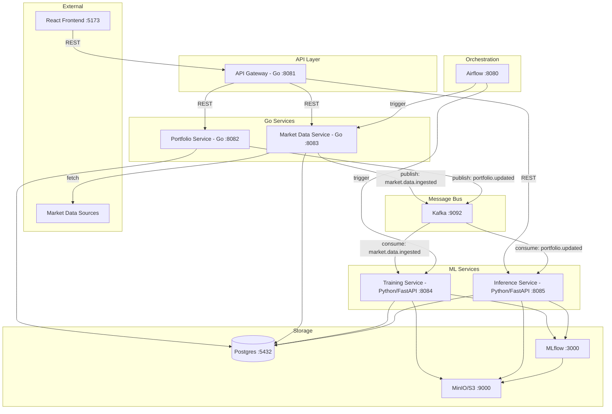
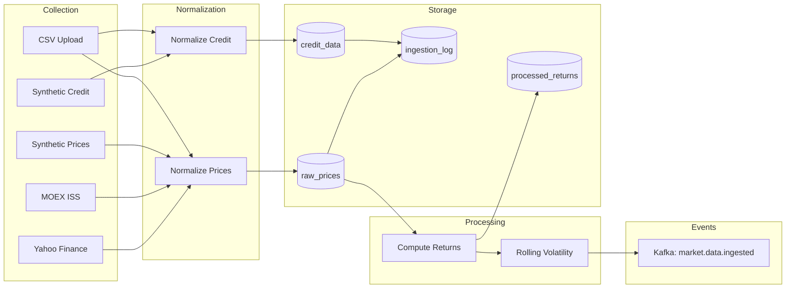
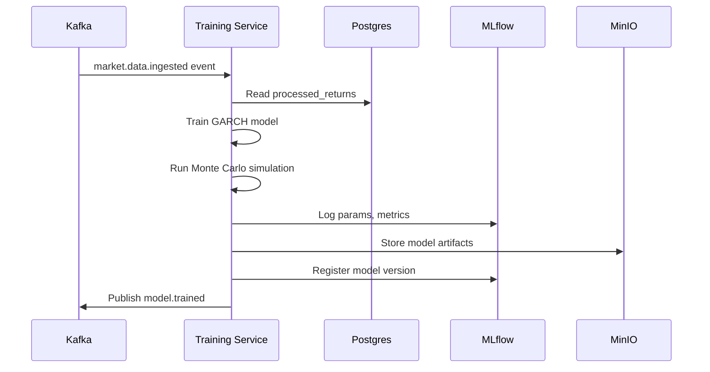

# RiskOps — Architecture Plan: Core MVP

## 1. Current State Analysis

### What exists today
- **Python CLI pipelines** (`apps/pipelines/`) — ingest synthetic data, compute returns, calculate historical VaR/CVaR, log to MLflow
- **Postgres schema** — `raw_prices`, `processed_returns`, `portfolios`, `portfolio_positions`, `risk_results`
- **Airflow DAG** — orchestrates pipeline steps via DockerOperator
- **MLflow** — tracks risk metrics as experiments
- **React UI** — expects REST API at `/api/...` (portfolios, risk, scenarios, alerts)
- **docker-compose** — Postgres, MLflow, Airflow, frontend, pipelines container, inference-service placeholder

### What's missing (core MVP scope)
- Go API services (no Go code exists yet)
- ML training pipeline (only statistical VaR exists, no ML models)
- Inference service (placeholder in docker-compose, no code)
- Market data collector (only synthetic generator exists)
- Kafka event bus
- MinIO / S3 for artifacts

---

## 2. Target Architecture



### Service Responsibilities

| Service | Language | Port | Responsibility |
|---------|----------|------|----------------|
| **API Gateway** | Go | 8081 | Route requests to services, auth placeholder, CORS |
| **Portfolio Service** | Go | 8082 | CRUD portfolios, positions, risk results read |
| **Market Data Service** | Go | 8083 | Ingest market + credit data from sources, store and process |
| **Training Service** | Python/FastAPI | 8084 | Train ML models, register in MLflow, store artifacts in S3 |
| **Inference Service** | Python/FastAPI | 8085 | Load models from MLflow, compute risk metrics on demand |

---

## 3. Go Project Structure

Monorepo layout with shared `pkg/` libraries for fast service assembly:

```
apps/
├── gateway/                    # API Gateway
│   ├── cmd/
|   |   └── main.go
│   ├── Dockerfile
│   └── internal/
│       ├── handler/            # HTTP handlers (proxy routes)
│       └── config/             # Config loading
│
├── portfolio-service/          # Portfolio Management
│   ├── cmd/
|   |   └── main.go
│   ├── Dockerfile
│   └── internal/
│       ├── handler/            # HTTP handlers
│       ├── service/            # Business logic
│       ├── repository/         # DB access
│       └── config/
│
├── market-data-service/        # Market Data Collector
│   ├── cmd/
|   |   └── main.go
│   ├── Dockerfile
│   └── internal/
│       ├── handler/            # HTTP handlers
│       ├── service/            # Business logic
│       ├── repository/         # DB access
│       ├── collector/          # Data source adapters
│       └── config/
│
├── training-service/           # ML Training (Python)
│   ├── Dockerfile
│   ├── pyproject.toml
│   └── training_service/
│       ├── main.py             # FastAPI app
│       ├── api/                # HTTP endpoints
│       ├── models/             # ML model definitions
│       ├── pipelines/          # Training pipelines
│       └── config.py
│
├── inference-service/          # ML Inference (Python)
│   ├── Dockerfile
│   ├── pyproject.toml
│   └── inference_service/
│       ├── main.py             # FastAPI app
│       ├── api/                # HTTP endpoints
│       ├── models/             # Model loading/serving
│       └── config.py
│
├── pipelines/                  # Existing CLI pipelines (keep as-is)
│   └── ...
│
pkg/                            # Shared Go libraries
├── httpserver/                  # Standard HTTP server setup
│   └── server.go               # chi router, middleware, graceful shutdown
├── postgres/                   # Postgres connection pool
│   └── postgres.go             # pgxpool wrapper
├── kafka/                      # Kafka producer/consumer
│   ├── producer.go
│   └── consumer.go
├── config/                     # Env-based config loader
│   └── config.go               # Simple envconfig
├── logger/                     # Structured logging
│   └── logger.go               # zap wrapper
└── models/                     # Shared domain types
    └── models.go               # Portfolio, Position, RiskResult, etc.
```

### Go Dependencies (minimal set)
- **HTTP**: `go-chi/chi` — lightweight router
- **Postgres**: `jackc/pgx` — native Go Postgres driver
- **Kafka**: `segmentio/kafka-go` — simple Kafka client
- **Config**: `kelseyhightower/envconfig` — env-based config
- **Logging**: `uber/zap` — structured logging
- **JSON**: `encoding/json` (stdlib)

### Key Design Principles
1. **No frameworks** — stdlib + minimal libraries
2. **Flat structure** — `internal/handler`, `internal/service`, `internal/repository` per service
3. **Shared `pkg/`** — reusable building blocks, each service imports what it needs
4. **Config via env vars** — no config files, 12-factor style
5. **Graceful shutdown** — context propagation, signal handling in `pkg/httpserver`

---

## 4. API Gateway Design

The gateway is a thin reverse proxy that routes requests to backend services.

```go
// Route mapping (simplified)
// /api/portfolios/*     → portfolio-service:8082
// /api/market-data/*    → market-data-service:8083
// /api/risk/predict     → inference-service:8085
// /api/risk/train       → training-service:8084
```

Features:
- **Reverse proxy** using `net/http/httputil.ReverseProxy`
- **CORS middleware** for frontend
- **Request logging** middleware
- **Health check** endpoint `/health`
- No auth in MVP (placeholder middleware for future)

---

## 5. Portfolio Service Design

### API Endpoints

| Method | Path | Description |
|--------|------|-------------|
| GET | `/api/portfolios` | List all portfolios |
| POST | `/api/portfolios` | Create portfolio |
| GET | `/api/portfolios/:id` | Get portfolio by ID |
| DELETE | `/api/portfolios/:id` | Delete portfolio |
| GET | `/api/portfolios/:id/positions` | List positions |
| POST | `/api/portfolios/:id/positions` | Add/update position |
| DELETE | `/api/portfolios/:id/positions/:symbol` | Remove position |
| GET | `/api/portfolios/:id/risk/latest` | Latest risk calculation |
| GET | `/api/portfolios/:id/risk` | Risk history |

### Kafka Events Published
- `portfolio.created` — when a new portfolio is created
- `portfolio.updated` — when positions change (triggers risk recalculation)

---

## 6. Market Data Service Design

The Market Data Service is the **single entry point for all external data** into the system. It handles two categories of data: **market prices** (equities, indices from Yahoo Finance and MOEX) and **credit portfolio data** (synthetic loan records for credit risk modeling). The service follows a **collector pattern** — each data source has its own adapter implementing a common interface, making it trivial to add new sources.

### What the service does

1. **Collects raw data** from external APIs and internal generators on a schedule or on-demand
2. **Normalizes data** into a unified format (symbol + date + value + metadata for prices; structured loan records for credit)
3. **Computes derived features** (returns, rolling volatility) needed by ML models
4. **Stores everything in Postgres** with full audit trail (what was ingested, when, from where)
5. **Publishes Kafka events** so downstream services (Training, Inference) react automatically

### API Endpoints

| Method | Path | Description |
|--------|------|-------------|
| POST | `/api/market-data/ingest` | Trigger data ingestion for specific source and symbols |
| POST | `/api/market-data/ingest/all` | Trigger full ingestion across all configured sources |
| GET | `/api/market-data/prices` | Get raw prices for symbols (with date range filter) |
| GET | `/api/market-data/returns` | Get processed returns for symbols |
| GET | `/api/market-data/credit` | Get credit portfolio data |
| GET | `/api/market-data/sources` | List available data sources and their status |
| GET | `/api/market-data/ingestion-log` | View ingestion history and errors |

### Data Sources

#### 1. Yahoo Finance API — International equities
- **What**: Daily OHLCV prices for US/international stocks, ETFs, indices
- **How**: HTTP calls to Yahoo Finance v8 API (no API key needed)
- **Symbols**: AAPL, MSFT, GOOGL, SPY, ^GSPC, etc.
- **Go implementation**: direct HTTP + JSON parsing (Yahoo Finance API is simple enough)
- **Schedule**: Daily after US market close (21:00 UTC)

#### 2. MOEX ISS API — Russian market
- **What**: Daily prices for Russian stocks, bonds, indices from Moscow Exchange
- **How**: MOEX ISS (Information and Statistical Server) — free public REST API, no auth needed
- **Base URL**: `https://iss.moex.com/iss`
- **Key endpoints**:
  - `/engines/stock/markets/shares/boards/TQBR/securities.json` — blue chips
  - `/history/engines/stock/markets/shares/securities/{ticker}.json` — historical prices
  - `/engines/stock/markets/index/securities.json` — indices like IMOEX, RTS
- **Symbols**: SBER, GAZP, LKOH, YNDX, IMOEX, etc.
- **Schedule**: Daily after MOEX close (19:00 UTC)

#### 3. Synthetic Market Data Generator
- **What**: Random walk price generator for testing without external APIs
- **How**: GBM (Geometric Brownian Motion) with configurable drift and volatility
- **Use case**: Development, testing, demos
- **Already exists** in Python CLI, will be rewritten in Go

#### 4. Synthetic Credit Data Generator
- **What**: Simulated credit portfolio data — loan records with borrower characteristics and default events
- **Generated fields**:
  - `loan_id` — unique loan identifier
  - `borrower_id` — borrower identifier
  - `loan_amount` — principal amount (e.g. 100K - 10M)
  - `interest_rate` — annual rate (3-25%)
  - `term_months` — loan term (12-360)
  - `credit_score` — borrower credit score (300-850)
  - `ltv_ratio` — loan-to-value ratio (0.3-1.2)
  - `dti_ratio` — debt-to-income ratio (0.1-0.6)
  - `is_default` — whether the loan defaulted (0/1)
  - `default_date` — when default occurred (if applicable)
  - `origination_date` — when loan was issued
  - `sector` — industry sector of borrower
- **How**: Statistical distributions calibrated to realistic credit portfolio characteristics
  - Default rates: ~2-5% base rate, correlated with credit score
  - Credit scores: bimodal distribution (prime + subprime)
  - LTV/DTI: truncated normal distributions
- **Use case**: Credit risk modeling, PD/LGD estimation, stress testing

#### 5. CSV Upload
- **What**: Manual data import for any data type (prices or credit)
- **How**: Upload CSV via API, service parses and stores
- **Use case**: Custom datasets, historical data backfill

### Collector Architecture

```go
// Each data source implements this interface
type Collector interface {
    // Name returns the source identifier
    Name() string
    // Collect fetches data for given symbols and date range
    Collect(ctx context.Context, req CollectRequest) (*CollectResult, error)
    // SupportedTypes returns what data types this collector provides
    SupportedTypes() []DataType  // market_price, credit_data
}

// CollectRequest is the input for any collector
type CollectRequest struct {
    Symbols   []string
    DateFrom  time.Time
    DateTo    time.Time
    DataType  DataType
}

// CollectResult is the normalized output
type CollectResult struct {
    Source      string
    DataType    DataType
    Prices      []PriceRecord      // for market data
    CreditData  []CreditRecord     // for credit data
    RowCount    int
}
```

Adding a new data source = implementing one interface. No changes to the rest of the service.

### Data Processing Pipeline

After raw data is collected, the service computes derived features:



**Step-by-step flow:**

1. **Trigger**: Airflow DAG calls `POST /api/market-data/ingest` with source + symbols + date range
2. **Collect**: Service picks the right collector adapter, fetches raw data
3. **Normalize**: Convert source-specific format to unified `PriceRecord` or `CreditRecord`
4. **Store raw**: INSERT into `raw_prices` or `credit_data` with UPSERT (idempotent)
5. **Compute returns**: For each symbol, calculate simple returns `(P_t - P_{t-1}) / P_{t-1}`
6. **Store processed**: INSERT into `processed_returns`
7. **Log ingestion**: Record what was ingested in `ingestion_log` (audit trail)
8. **Publish event**: Send `market.data.ingested` to Kafka with symbols, date range, and data type
9. **Downstream**: Training Service picks up the event and retrains models; Inference Service refreshes predictions

### Data Storage

All data lives in Postgres with clear separation:

| Table | Purpose | Key columns |
|-------|---------|-------------|
| `raw_prices` | Raw OHLCV from any market source | symbol, price_date, close, source |
| `processed_returns` | Computed daily returns | symbol, price_date, ret |
| `credit_data` | Credit portfolio loan records | loan_id, borrower_id, credit_score, is_default |
| `ingestion_log` | Audit trail of all ingestions | source, data_type, symbols, rows_ingested, status |

### Scheduling

| Source | Schedule | Trigger |
|--------|----------|---------|
| Yahoo Finance | Daily 21:00 UTC | Airflow DAG |
| MOEX ISS | Daily 19:00 UTC | Airflow DAG |
| Synthetic Prices | On-demand | API call |
| Synthetic Credit | On-demand | API call |
| CSV Upload | On-demand | API call |

---

## 7. Training Service Design (Python/FastAPI)

### API Endpoints

| Method | Path | Description |
|--------|------|-------------|
| POST | `/api/risk/train` | Trigger model training |
| GET | `/api/risk/train/status/:run_id` | Get training status |
| GET | `/api/risk/models` | List registered models |

### ML Models for MVP

Three approaches to VaR/CVaR estimation, progressively more complex:

1. **Historical Simulation** (baseline, already exists)
   - Non-parametric, uses empirical distribution of returns
   - Fast, no training needed

2. **GARCH(1,1) Volatility Model**
   - Captures volatility clustering in financial time series
   - Parametric VaR using conditional volatility forecast
   - Library: `arch` Python package
   - Good for: single-asset and portfolio volatility forecasting

3. **Monte Carlo with GBM** (Geometric Brownian Motion)
   - Simulate future price paths using estimated drift and volatility
   - VaR/CVaR from simulated portfolio return distribution
   - Can incorporate correlation structure between assets

### Training Pipeline


### MLflow Integration
- **Experiment**: `riskops-{model_type}` (e.g., `riskops-garch`, `riskops-montecarlo`)
- **Tracked params**: symbols, lookback_days, alpha, model hyperparams
- **Tracked metrics**: VaR, CVaR, volatility, backtest_coverage_ratio
- **Artifacts**: serialized model, backtest plots, risk report JSON

---

## 8. Inference Service Design (Python/FastAPI)

### API Endpoints

| Method | Path | Description |
|--------|------|-------------|
| POST | `/api/risk/predict` | Calculate risk for portfolio |
| GET | `/api/risk/predict/health` | Model health check |

### Request/Response

```json
// POST /api/risk/predict
{
  "portfolio_id": 1,
  "method": "garch",       // historical | garch | montecarlo
  "alpha": 0.99,
  "horizon_days": 1
}

// Response
{
  "portfolio_id": 1,
  "asof_date": "2024-12-31",
  "method": "garch",
  "alpha": 0.99,
  "horizon_days": 1,
  "var": 0.0234,
  "cvar": 0.0312,
  "volatility": 0.0189,
  "model_version": "garch-v2",
  "computed_at": "2025-01-15T10:30:00Z"
}
```

### Model Loading
- On startup: load latest production model from MLflow Model Registry
- On `model.trained` Kafka event: hot-reload new model version
- Fallback: historical simulation if no ML model available

---

## 9. Kafka Event Design

### Topics

| Topic | Producer | Consumer | Payload |
|-------|----------|----------|---------|
| `market.data.ingested` | Market Data Service | Training Service, Inference Service | `{symbols, date_range, source, data_type}` |
| `portfolio.updated` | Portfolio Service | Inference Service | `{portfolio_id, action}` |
| `model.trained` | Training Service | Inference Service | `{model_name, version, run_id}` |
| `risk.calculated` | Inference Service | Portfolio Service | `{portfolio_id, metrics}` |

### Kafka Configuration (MVP)
- Single broker, 1 partition per topic (scale later)
- Consumer groups per service
- JSON serialization (Avro/Protobuf later)

---

## 10. Database Schema Evolution

Extend the existing schema with additions for credit data and model tracking:

```sql
-- Add to existing schema

-- Credit portfolio data (synthetic for MVP)
CREATE TABLE IF NOT EXISTS credit_data (
    id BIGSERIAL PRIMARY KEY,
    loan_id TEXT NOT NULL UNIQUE,
    borrower_id TEXT NOT NULL,
    loan_amount NUMERIC(18, 2) NOT NULL,
    interest_rate NUMERIC(8, 5) NOT NULL,
    term_months INT NOT NULL,
    credit_score INT NOT NULL,
    ltv_ratio NUMERIC(8, 5),
    dti_ratio NUMERIC(8, 5),
    is_default BOOLEAN NOT NULL DEFAULT FALSE,
    default_date DATE,
    origination_date DATE NOT NULL,
    sector TEXT,
    source TEXT NOT NULL DEFAULT 'synthetic',
    ingested_at TIMESTAMPTZ NOT NULL DEFAULT NOW()
);

CREATE INDEX IF NOT EXISTS idx_credit_data_borrower ON credit_data (borrower_id);
CREATE INDEX IF NOT EXISTS idx_credit_data_default ON credit_data (is_default);
CREATE INDEX IF NOT EXISTS idx_credit_data_origination ON credit_data (origination_date);

-- Model registry tracking (supplements MLflow)
CREATE TABLE IF NOT EXISTS model_registry (
    id BIGSERIAL PRIMARY KEY,
    model_name TEXT NOT NULL,
    model_version TEXT NOT NULL,
    mlflow_run_id TEXT,
    status TEXT NOT NULL DEFAULT 'staging',  -- staging | production | archived
    metrics JSONB,
    created_at TIMESTAMPTZ NOT NULL DEFAULT NOW(),
    UNIQUE(model_name, model_version)
);

-- Data ingestion log
CREATE TABLE IF NOT EXISTS ingestion_log (
    id BIGSERIAL PRIMARY KEY,
    source TEXT NOT NULL,
    data_type TEXT NOT NULL DEFAULT 'market_price',  -- market_price | credit_data
    symbols TEXT[] NOT NULL,
    date_from DATE NOT NULL,
    date_to DATE NOT NULL,
    rows_ingested INT NOT NULL DEFAULT 0,
    status TEXT NOT NULL DEFAULT 'completed',
    error_message TEXT,
    created_at TIMESTAMPTZ NOT NULL DEFAULT NOW()
);

-- Extend risk_results with model reference
-- (existing table already has model_version TEXT column - sufficient for MVP)
```

---

## 11. Airflow DAGs

### Daily Risk Pipeline DAG
```
schedule: daily at 06:00 UTC (before market open)

ingest_market_data → compute_returns → train_models → run_inference → store_results
```

### Market Data Ingestion DAGs
```
schedule: MOEX at 19:00 UTC, Yahoo at 21:00 UTC

ingest_moex → process_returns → publish_event
ingest_yahoo → process_returns → publish_event
```

### On-Demand Training DAG
```
schedule: triggered via API or Kafka event

fetch_data → train_garch → train_montecarlo → evaluate → register_best_model
```

Implementation: Keep using DockerOperator (each step runs in its own container), but now calling Go/Python service APIs instead of CLI commands.

---

## 12. Docker & Deployment

### New docker-compose services

```yaml
# Added services:
gateway:           # Go API Gateway
portfolio-service: # Go Portfolio Service
market-data-service: # Go Market Data Service
training-service:  # Python Training Service
inference-service: # Python Inference Service (replace placeholder)
kafka:             # Kafka broker
zookeeper:         # Kafka dependency (or use KRaft mode)
minio:             # S3-compatible storage
```

### Build Strategy
- Go services: multi-stage build (build in golang:1.23, run in alpine)
- Python services: python:3.11-slim with uv for fast installs
- Shared Go module: `go.mod` at repo root, services import `pkg/`

### Go Module Layout
```
go.mod                          # module github.com/riskops/riskops
go.sum
pkg/                            # shared libraries
apps/gateway/main.go            # imports riskops/pkg/...
apps/portfolio-service/main.go  # imports riskops/pkg/...
apps/market-data-service/main.go
```

---

## 13. Implementation Order

The work is split into phases. Each phase produces a working, testable increment.

### Phase 1: Go Foundation + Portfolio Service (done)
1. Initialize Go module at repo root (`go.mod`)
2. Build `pkg/` shared libraries (httpserver, postgres, config, logger, models)
3. Build Portfolio Service with full CRUD
4. Build API Gateway with proxy to Portfolio Service
5. Update docker-compose, verify frontend can talk to API

### Phase 2: Market Data Service (done)
6. Build Market Data Service with collector interface — `apps/market-data-service/internal/collector/collector.go` (`Collector`, `CollectRequest`, `CollectResult`); wired in `main.go`
7. Implement synthetic price generator (Go) — `apps/market-data-service/internal/collector/synthetic.go` (GBM / synthetic prices)
8. Implement Yahoo Finance collector — `apps/market-data-service/internal/collector/yahoo.go` (Yahoo Finance v8 chart API)
9. Implement MOEX ISS collector
10. Implement synthetic credit data generator
11. Add MinIO to docker-compose for artifact storage
12. Wire Airflow DAG to call Market Data Service API

### Phase 3: Kafka Integration (done)
13. Add Kafka + Zookeeper to docker-compose
14. Add `pkg/kafka` producer/consumer
15. Portfolio Service publishes `portfolio.updated`
16. Market Data Service publishes `market.data.ingested`

### Phase 4: ML Training Service (done)
17. Build Training Service (FastAPI)
18. Implement GARCH model training pipeline
19. Implement Monte Carlo simulation pipeline
20. MLflow integration (log experiments, register models)
21. Kafka consumer for `market.data.ingested`

STUDY HOW THIS MODELS WORKS

### Phase 5: Inference Service
22. Build Inference Service (FastAPI)
23. Model loading from MLflow
24. Risk prediction endpoint (VaR, CVaR, volatility)
25. Kafka consumer for `portfolio.updated` and `model.trained`
26. Store results in `risk_results` table

### Phase 6: Airflow DAGs + Integration
27. Update Airflow DAGs for new service architecture
28. Daily risk pipeline DAG
29. Market data ingestion DAGs (MOEX + Yahoo schedules)
30. On-demand training DAG
31. End-to-end integration testing

### Phase 7: Add Prometheus + Grafana (done)
32. Prometheus + Grafana in docker-compose (`9090` / `3001`)
33. Go services expose `/metrics` (Prometheus client: Go/process/build info)
34. Grafana: provisioned Prometheus datasource + RiskOps overview dashboard

### Phase 8: Alerting Service
35. Send alerts to telegram-bot or email

---

## 14. File Tree Summary (what will be created)

```
riskops/
├── go.mod
├── go.sum
├── Makefile                          # extended
├── docker-compose.yaml               # extended
├── pkg/
│   ├── httpserver/server.go
│   ├── postgres/postgres.go
│   ├── kafka/producer.go
│   ├── kafka/consumer.go
│   ├── config/config.go
│   ├── logger/logger.go
│   └── models/models.go
├── apps/
│   ├── gateway/
│   │   ├── main.go
│   │   ├── Dockerfile
│   │   └── internal/
│   │       ├── handler/proxy.go
│   │       └── config/config.go
│   ├── portfolio-service/
│   │   ├── main.go
│   │   ├── Dockerfile
│   │   └── internal/
│   │       ├── handler/portfolio.go
│   │       ├── handler/position.go
│   │       ├── handler/risk.go
│   │       ├── service/portfolio.go
│   │       ├── repository/portfolio.go
│   │       └── config/config.go
│   ├── market-data-service/
│   │   ├── main.go
│   │   ├── Dockerfile
│   │   └── internal/
│   │       ├── handler/ingest.go
│   │       ├── handler/prices.go
│   │       ├── handler/credit.go
│   │       ├── service/ingest.go
│   │       ├── service/returns.go
│   │       ├── repository/prices.go
│   │       ├── repository/credit.go
│   │       ├── collector/yahoo.go
│   │       ├── collector/moex.go
│   │       ├── collector/synthetic.go
│   │       ├── collector/credit_synthetic.go
│   │       └── config/config.go
│   ├── training-service/
│   │   ├── Dockerfile
│   │   ├── pyproject.toml
│   │   └── training_service/
│   │       ├── main.py
│   │       ├── api/routes.py
│   │       ├── models/garch.py
│   │       ├── models/montecarlo.py
│   │       ├── pipelines/train.py
│   │       ├── kafka_consumer.py
│   │       └── config.py
│   ├── inference-service/
│   │   ├── Dockerfile
│   │   ├── pyproject.toml
│   │   └── inference_service/
│   │       ├── main.py
│   │       ├── api/routes.py
│   │       ├── models/loader.py
│   │       ├── models/predictor.py
│   │       ├── kafka_consumer.py
│   │       └── config.py
│   └── pipelines/                    # existing, keep as-is
├── infra/
│   ├── airflow/dags/
│   │   ├── riskops_smoke_dag.py      # existing
│   │   ├── daily_risk_dag.py         # new
│   │   ├── market_data_dag.py        # new (MOEX + Yahoo schedules)
│   │   └── training_dag.py           # new
│   ├── db/init/
│   │   ├── 000_mlflow_schema.sql     # existing
│   │   ├── 001_riskops_schema.sql    # existing
│   │   └── 002_extensions.sql        # new (credit_data, model_registry, ingestion_log)
│   └── kafka/                        # Kafka config if needed
├── ui/                               # existing, no changes in core MVP
└── scripts/                          # helper scripts
```

## Recomendations:
```
Николай, добрый день!

По метрикам риска, которые используются в индустрии: основные — это VaR (Value at Risk), CVaR (Expected Shortfall), волатильность портфеля, максимальная просадка (Max Drawdown), Beta к бенчмарку, а также risk-adjusted метрики типа Sharpe и Sortino.

По данным: понадобятся цены и доходности активов (дневные или более частые), данные по бенчмаркам (индексы), историческая и implied волатильность, корреляционные матрицы между активами, а также макро-факторы (процентные ставки, VIX и т.д.).

По моделям: классика — это исторический VaR (квантиль прошлых доходностей), параметрический VaR (предполагает нормальное распределение), Monte Carlo симуляции. Для моделирования волатильности используют HAR-семейство. Желательно обратить внимание на зависимости между активами. 

На перспективу рекомендовал бы Вам изучить рыночно-нейтральные и риск-нейтральные стратегии — это даст понимание, как на практике работает индустрия.
```

## MLOps Architecture
```
┌─────────────────────────────────────────────────────────┐
│                    SCHEDULER (Airflow/Cron)              │
│                     Ежедневно в 18:00                   │
└────────────────────────┬────────────────────────────────┘
                         │
            ┌────────────┴────────────┐
            ▼                         ▼
   ┌──────────────────┐    ┌──────────────────────┐
   │  BACKTESTING     │    │  PARAMETER MONITOR   │
   │  PIPELINE        │    │                      │
   │                  │    │  α + β < 0.999?      │
   │  violations_rate │    │  ω > 0?              │
   │  Kupiec test     │    │  log_likelihood OK?  │
   │  Christoffersen  │    │                      │
   └────────┬─────────┘    └──────────┬───────────┘
            │                          │
            └──────────┬───────────────┘
                       ▼
              ┌─────────────────┐
              │   ALERT ENGINE  │
              │                 │
              │  OK → continue  │
              │  WARN → notify  │
              │  CRIT → retrain │
              └────────┬────────┘
                       │
                       ▼
              ┌─────────────────┐
              │ RETRAINING JOB  │
              │                 │
              │ Rolling window  │
              │ Fit new model   │
              │ Shadow mode     │
              │ A/B compare     │
              │ Promote/Reject  │
              └────────┬────────┘
                       │
                       ▼
              ┌─────────────────┐
              │    MLFLOW       │
              │                 │
              │  Log params     │
              │  Log metrics    │
              │  Register model │
              │  Version bump   │
              └─────────────────┘
```