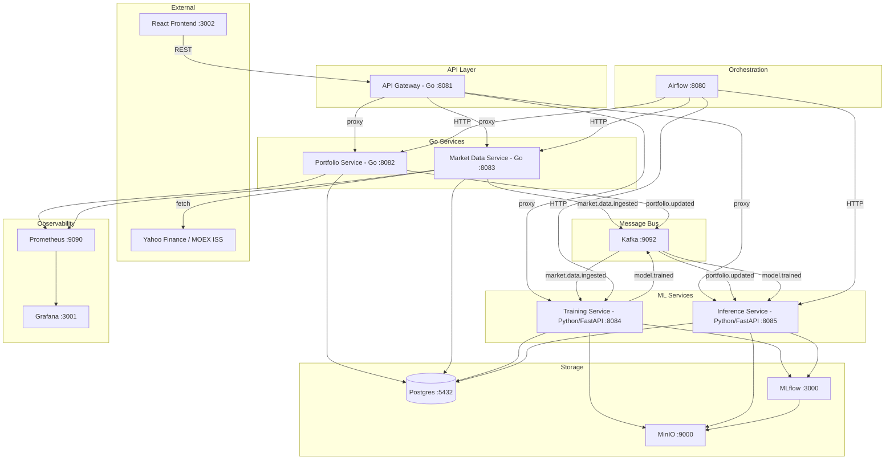

# RiskOps — Architecture Plan (актуальный)

## 1. Текущая архитектура



### Сервисы

| Сервис | Язык | Порт | Ответственность |
|--------|------|------|-----------------|
| API Gateway | Go | 8081 | Reverse proxy, CORS, `/health` |
| Portfolio Service | Go | 8082 | CRUD портфелей/позиций, чтение risk_results, Kafka producer |
| Market Data Service | Go | 8083 | Yahoo Finance, MOEX ISS, Synthetic GBM, Synthetic Credit, ingestion_log, Kafka producer |
| Training Service | Python/FastAPI | 8084 | GARCH(1,1), Monte Carlo GBM, MLflow, backtesting, Kafka consumer/producer |
| Inference Service | Python/FastAPI | 8085 | Загрузка моделей из MLflow, predict, stress testing, Kafka consumer |

---

## 2. Структура проекта

```
riskops/
├── go.mod / go.sum
├── Makefile
├── docker-compose.yaml
├── pkg/
│   ├── config/config.go          # env-based config (envconfig)
│   ├── logger/logger.go          # zap wrapper
│   └── postgres/postgres.go      # pgxpool wrapper
├── apps/
│   ├── gateway/
│   │   ├── main.go
│   │   └── internal/
│   │       ├── handler/proxy.go
│   │       ├── handler/cors.go
│   │       └── config/config.go
│   ├── portfolio-service/
│   │   ├── main.go
│   │   ├── openapi.yaml
│   │   └── internal/
│   │       ├── handler/portfolio.go
│   │       ├── service/portfolio.go
│   │       ├── repository/portfolio.go
│   │       └── config/config.go
│   ├── market-data-service/
│   │   ├── main.go
│   │   ├── openapi.yaml
│   │   └── internal/
│   │       ├── handler/market_data.go
│   │       ├── service/ingest.go
│   │       ├── service/returns.go
│   │       ├── repository/prices.go
│   │       ├── repository/credit.go
│   │       ├── repository/ingestion_log.go
│   │       ├── collector/collector.go      # Collector interface
│   │       ├── collector/yahoo.go
│   │       ├── collector/moex.go
│   │       ├── collector/synthetic.go
│   │       ├── collector/credit_synthetic.go
│   │       └── config/config.go
│   ├── training-service/
│   │   └── training_service/
│   │       ├── main.py
│   │       ├── config.py
│   │       ├── db.py
│   │       ├── kafka_consumer.py
│   │       ├── api/routes.py               # POST /train, GET /train/status, GET /models, POST /backtest
│   │       ├── models/garch.py             # GARCH(1,1): normal/t/skewt
│   │       ├── models/montecarlo.py        # Monte Carlo GBM
│   │       ├── models/mc_pyfunc.py         # MLflow pyfunc wrapper
│   │       ├── pipelines/train.py          # run_training() entry point
│   │       ├── backtesting/
│   │       │   ├── rolling_backtest.py     # rolling window engine
│   │       │   ├── kupiec.py               # Kupiec LR test
│   │       │   ├── christoffersen.py       # Christoffersen CC test
│   │       │   └── report.py
│   │       └── metrics/risk_metrics.py     # MDD, Sharpe, Sortino, Beta, Correlation
│   ├── inference-service/
│   │   └── inference_service/
│   │       ├── main.py
│   │       ├── config.py
│   │       ├── db.py
│   │       ├── kafka_consumer.py           # portfolio.updated + model.trained
│   │       ├── api/routes.py               # POST /predict, GET /scenarios, POST /scenarios/run
│   │       ├── models/loader.py            # ModelRegistry, load from MLflow
│   │       ├── models/predictor.py         # historical / garch / montecarlo predict
│   │       └── scenarios/engine.py         # stress testing: parametric + historical replay
│   └── frontend/
│       └── src/
│           ├── app/                        # Next.js pages
│           └── lib/api.ts
├── infra/
│   ├── airflow/dags/
│   │   ├── daily_risk_dag.py               # 06:00 UTC: ingest→train→infer→verify
│   │   ├── market_data_dag.py              # MOEX 19:00 + Yahoo 21:00 UTC
│   │   └── training_dag.py                 # on-demand retraining
│   ├── db/init/
│   │   ├── 000_mlflow_schema.sql
│   │   ├── 001_riskops_schema.sql
│   │   └── 002_extensions.sql              # credit_data, model_registry, ingestion_log
│   ├── grafana/
│   └── prometheus/
└── plans/
    └── architecture-plan.md
```

---

## 3. API

### Portfolio Service (:8082)

| Method | Path | Описание |
|--------|------|----------|
| GET | `/api/portfolios` | Список портфелей |
| POST | `/api/portfolios` | Создать портфель |
| GET | `/api/portfolios/:id` | Получить портфель |
| DELETE | `/api/portfolios/:id` | Удалить портфель |
| GET | `/api/portfolios/:id/positions` | Позиции портфеля |
| POST | `/api/portfolios/:id/positions` | Добавить/обновить позицию |
| DELETE | `/api/portfolios/:id/positions/:symbol` | Удалить позицию |
| GET | `/api/portfolios/:id/risk/latest` | Последний расчёт риска |
| GET | `/api/portfolios/:id/risk` | История риска |

### Market Data Service (:8083)

| Method | Path | Описание |
|--------|------|----------|
| POST | `/api/market-data/ingest` | Запустить ingestion (source + symbols) |
| POST | `/api/market-data/ingest/all` | Полный ingestion всех источников |
| GET | `/api/market-data/prices` | Цены (с фильтром по дате) |
| GET | `/api/market-data/returns` | Обработанные доходности |
| GET | `/api/market-data/credit` | Кредитные данные |
| GET | `/api/market-data/sources` | Доступные источники |
| GET | `/api/market-data/ingestion-log` | История ingestion |

### Training Service (:8084)

| Method | Path | Описание |
|--------|------|----------|
| POST | `/api/risk/train` | Запустить обучение (async, возвращает job_id) |
| GET | `/api/risk/train/status/:job_id` | Статус задачи из Postgres |
| GET | `/api/risk/train/run/:run_id` | Детали MLflow run |
| GET | `/api/risk/models` | Список моделей из model_registry |
| POST | `/api/risk/backtest` | On-demand rolling backtest |

### Inference Service (:8085)

| Method | Path | Описание |
|--------|------|----------|
| POST | `/api/risk/predict` | Расчёт риска (VaR, CVaR, vol, MDD, Sharpe, Sortino) |
| GET | `/api/risk/predict/health` | Какие модели загружены |
| GET | `/api/risk/scenarios` | Каталог стресс-сценариев |
| POST | `/api/risk/scenarios/run` | Запустить стресс-тест |

---

## 4. Kafka Topics

| Topic | Producer | Consumer | Payload |
|-------|----------|----------|---------|
| `market.data.ingested` | Market Data Service | Training Service | `{symbols, date_range, source, data_type}` |
| `portfolio.updated` | Portfolio Service | Inference Service | `{portfolio_id, action}` |
| `model.trained` | Training Service | Inference Service | `{model_name, version, run_id}` |

---

## 5. База данных

| Таблица | Назначение |
|---------|-----------|
| `raw_prices` | Сырые OHLCV данные от коллекторов |
| `processed_returns` | Вычисленные дневные доходности |
| `credit_data` | Синтетические кредитные записи |
| `ingestion_log` | Аудит-лог всех ingestion |
| `portfolios` | Портфели |
| `portfolio_positions` | Позиции в портфелях |
| `risk_results` | Результаты расчётов риска (VaR, CVaR, vol, MDD, Sharpe, Sortino) |
| `model_registry` | Зарегистрированные модели (дублирует MLflow) |
| `training_jobs` | Состояние задач обучения (survives restart) |

---

## 6. ML-модели

### GARCH(1,1) — `riskops-garch`
- Библиотека: `arch`
- Дистрибуции: `normal`, `t` (fitted df), `skewt` (fitted nu + lambda)
- Выход: VaR, CVaR (параметрические), conditional volatility forecast
- Артефакт: pickle `ARCHModelResult` → MLflow

### Monte Carlo GBM — `riskops-montecarlo`
- GBM с историческими μ и σ портфеля
- Выход: VaR, CVaR из симулированного распределения P&L
- Артефакт: `mlflow.pyfunc` модель (`MonteCarloModel`) → MLflow

### Historical Simulation — fallback
- Эмпирический квантиль из `processed_returns`
- Не требует обучения, всегда доступен

### Дополнительные метрики (все методы)
- Max Drawdown, Sharpe Ratio, Sortino Ratio, Beta (если передан benchmark)

---

## 7. Backtesting Engine

Rolling window out-of-sample:
```
Training window: [t-lookback, t-1] → Fit model → Predict VaR(t)
                                                        ↓
                                          Check: return(t) < -VaR(t)?
                                                        ↓
                                          Record violation: 1 or 0
Slide window by 1 day → repeat for all t in [T_train+1, T_end]
```

Статистические тесты:
- **Kupiec UC** — проверяет, что violation rate = 1 - α
- **Christoffersen CC** — дополнительно проверяет независимость нарушений

Пороги:
- `p-value > 0.05` → **OK**
- `0.01 < p ≤ 0.05` → **WARN**
- `p ≤ 0.01` → **CRIT**

---

## 8. Stress Testing

5 встроенных сценариев:

| ID | Тип | Описание |
|----|-----|----------|
| `historical_2008` | historical | Lehman collapse, equity −50% |
| `historical_2020` | historical | COVID crash, VIX > 80 |
| `historical_1998` | historical | LTCM / Russia default |
| `parametric_mild` | parametric | vol×2, corr→0.7 |
| `parametric_severe` | parametric | vol×4, corr→0.95 |

**Важно:** historical сценарии падают в parametric fallback если в БД нет данных за кризисный период (при synthetic data — всегда). Ответ API не сигнализирует об этом явно.

---

## 9. Airflow DAGs

### `riskops_daily_risk_pipeline` (06:00 UTC)
```
health_checks → ingest_market_data → train_models → poll_training → run_inference → verify_results
```

### `riskops_market_data_ingest` (MOEX 19:00 + Yahoo 21:00 UTC)
```
ingest_moex → process_returns → publish_event
ingest_yahoo → process_returns → publish_event
```

### `riskops_training` (on-demand / scheduled)
```
fetch_data → train_garch → train_montecarlo → evaluate → register_best_model
```

---

## 10. Известные баги

### Критические

**BUG-1: `predict_garch` в Inference Service игнорирует дистрибуцию модели**
`apps/inference-service/inference_service/models/predictor.py:248`
```python
# Всегда Normal, даже если модель обучена с dist="t" или dist="skewt"
z_alpha = stats.norm.ppf(1.0 - alpha)
```
**Fix:** делегировать в `_var_cvar_from_dist()` из training-service, передавая `fit_result.params`.

**BUG-2: Historical replay сценарии молча деградируют в parametric**
`apps/inference-service/inference_service/scenarios/engine.py:228`
При отсутствии данных за кризисный период функция возвращает пустой массив и падает в parametric fallback, но `scenario_type` в ответе остаётся `"historical"`.
**Fix:** добавить поле `fallback_used: bool` в `StressResult` и `ScenarioRunResponse`.

**BUG-3: `_compute_max_drawdown` в `engine.py` не защищена от деления на ноль**
`apps/inference-service/inference_service/scenarios/engine.py:258`
Нет `np.errstate` + `np.where` защиты (в отличие от корректной реализации в `risk_metrics.py:53`).
**Fix:** скопировать паттерн из `risk_metrics.py`.

**BUG-4: Backtest Monte Carlo pipeline использует `historical` модель**
`apps/training-service/training_service/pipelines/train.py:443`
```python
model_type="historical"  # должно быть "montecarlo"
```
Backtest-метрики в MLflow для MC run не отражают качество MC-модели.

### Значимые

**BUG-5: `Sortino = float("inf")` ломает JSON-сериализацию**
`apps/training-service/training_service/metrics/risk_metrics.py:111`
```python
return float("inf")  # невалидный JSON, MLflow logging упадёт
```
**Fix:** `return None`

**BUG-6: Двойная регистрация модели без синхронизации**
`model_registry` (Postgres) и MLflow Model Registry — два независимых источника истины. При ручном удалении версии в MLflow Postgres не обновится.
**Fix:** убрать `model_registry` таблицу, читать напрямую из MLflow через `MlflowClient`.

**~~BUG-7: Beta всегда `None` в production~~** ✅ FIXED
`apps/training-service/training_service/pipelines/train.py` — добавлена функция `load_benchmark_returns()`, которая пробует загрузить SPY → IMOEX.ME → IMOEX из `processed_returns`. Benchmark передаётся в `compute_all()` через оба pipeline (`_train_garch_pipeline`, `_train_montecarlo_pipeline`). Если benchmark недоступен — Beta остаётся `None` (non-fatal).

**BUG-8: Race condition при shutdown Training Service**
`apps/training-service/training_service/api/routes.py:332` — двойная обёртка: FastAPI `BackgroundTasks` + `ThreadPoolExecutor`. При shutdown FastAPI может убить задачу до завершения, оставив job в статусе `running`.
**Fix:** использовать только `ThreadPoolExecutor`, убрать `BackgroundTasks`.

---

## 11. Что нужно реализовать

### Высокий приоритет

**FEAT-1: Alerting Service (Phase 8)**
Telegram-бот или email при `backtest_status = CRIT`. Все компоненты готовы (backtesting engine, Kafka, Airflow). Нужен только consumer + notifier.

**FEAT-2: Автоматический MLOps Loop**
Airflow DAG для ежедневного мониторинга:
```
run_backtest → check_garch_params → aggregate_alerts → [OK: log] / [WARN: notify] / [CRIT: retrain]
```
GARCH health check:
```python
def check_garch_health(params):
    persistence = params["alpha[1]"] + params["beta[1]"]
    if persistence >= 1.0 or params["omega"] <= 0: return "CRIT"
    if persistence >= 0.999: return "WARN"
    return "OK"
```

**FEAT-3: Correlation matrix в API и на фронте**
- Добавить `GET /api/risk/correlation?portfolio_id=1` в Inference Service
- Вызывать `correlation_matrix()` из `risk_metrics.py` (уже реализована)
- Отображать heatmap на странице `/portfolio` фронтенда

**FEAT-4: Макропоказатели**
VIX, ставки ЦБ РФ/ФРС, кривая доходности — как факторы для factor-моделей. Сейчас полностью отсутствуют. Новый коллектор в Market Data Service.

### Средний приоритет

**FEAT-5: Rolling volatility persistence**
Добавить таблицу `rolling_volatility` и вычислять 20-day/60-day rolling std в `apps/market-data-service/internal/service/returns.go` после `UpsertReturns()`. Разблокирует Grafana дашборды с историей волатильности.

**FEAT-6: HAR-RV модель**
Heterogeneous Autoregressive Realized Volatility — лучше GARCH для прогнозирования волатильности. Использует realized variance на daily/weekly/monthly горизонтах.

**FEAT-7: Shadow mode в Inference Service**
Новая модель запускается параллельно со старой, метрики сравниваются, лучшая автоматически промоутится. MLflow Model Registry уже есть.

**FEAT-8: e-disclosure.ru коллектор**
Корпоративная отчётность РСБУ/МСФО для кредитного риска и PD/LGD моделей. Новый коллектор `apps/market-data-service/internal/collector/edisclosure.go`.

### Низкий приоритет

**FEAT-9: Prometheus метрики в Python-сервисах**
Go-сервисы экспонируют `/metrics`. Python-сервисы — нет. Добавить `prometheus-fastapi-instrumentator` в training-service и inference-service.

**FEAT-10: Аутентификация в Gateway**
JWT или API-key middleware в `apps/gateway/internal/handler/`. Сейчас auth — placeholder.

**FEAT-11: CSV Upload коллектор**
Ручной импорт исторических данных через API. Описан в архитектуре, не реализован.

**FEAT-12: Unit-тесты для Python ML-кода**
Есть только integration tests для Go-коллекторов. Нет unit-тестов для backtesting, risk_metrics, GARCH, Monte Carlo.

---

## 12. MVP Checklist

| Критерий | Статус |
|----------|--------|
| End-to-end pipeline: market data → training → inference → UI | ✅ |
| Statistically correct backtest (Kupiec + Christoffersen) | ✅ |
| ≥3 stress test scenarios | ✅ (5 сценариев) |
| 7 risk metrics: VaR, CVaR, vol, MDD, Sharpe, Sortino, Beta | ✅ Beta вычисляется (SPY/IMOEX benchmark) |
| Model drift monitoring in Grafana | ⚠️ Grafana есть, VaR violations dashboard — нет |
| Automated retraining trigger on CRIT alert | ❌ Phase 8 не начата |
| Model versioning with rollback in MLflow | ✅ |
| Training job state persisted (survives restart) | ✅ |
